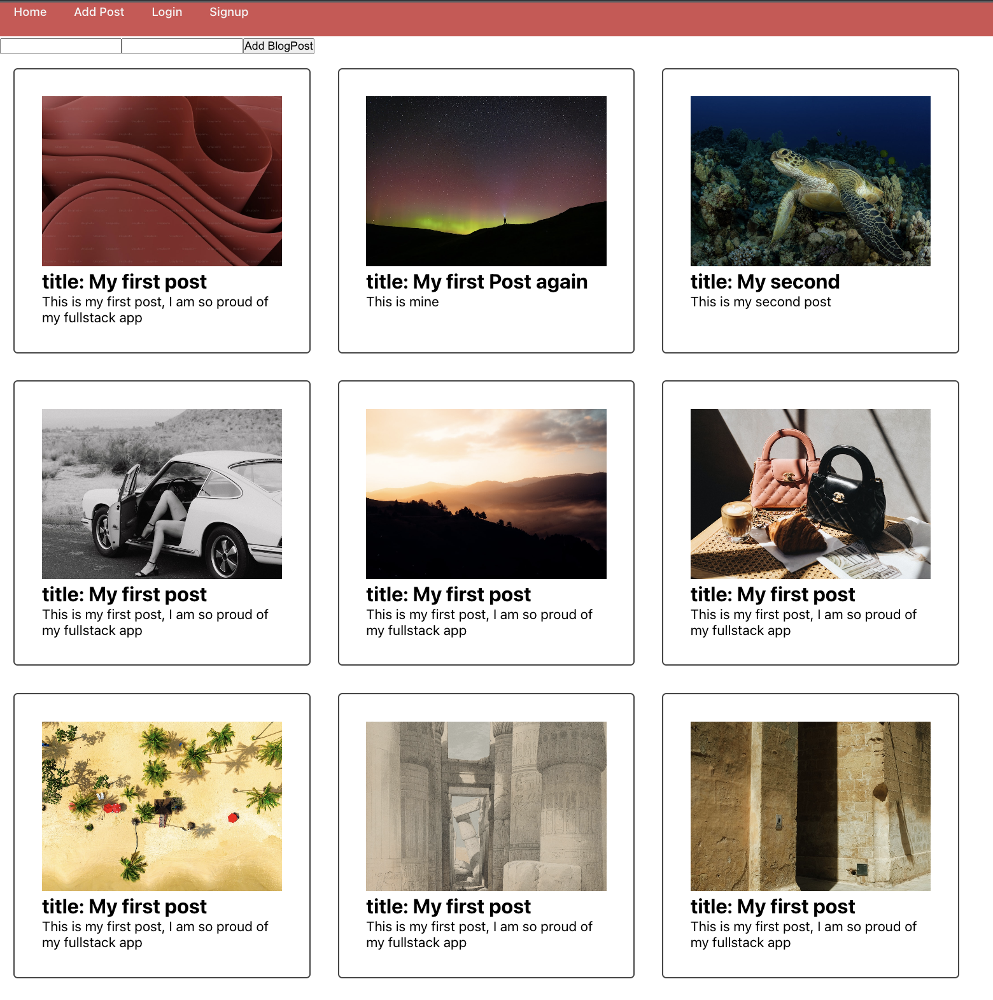

# My Blog App

This is the front end for a full stack blog app with login.

[ (https://www.google.com/)]

## Build Instruction
1. git clone (https://github.com/benson-optimiste1/frontend-blogapp)
2. cd backend-blogapp
3. obtain .env for environmentall variables
4. npm i 
5. node .

## Backend Repo
[Click here to view the backend] (https://github.com/benson-optimiste1/backend-blogapp)
